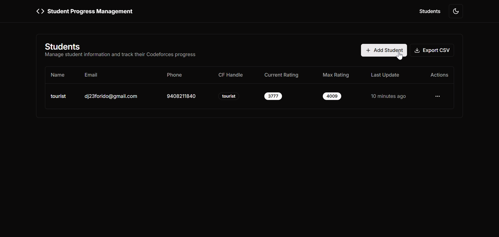

# Student Progress Management System

A comprehensive web application for tracking and managing student coding progress on Codeforces with automated data synchronization and analytics.

## Watch Demo (Click to watch walkthrough video)
[](https://drive.google.com/file/d/1eq_5s50sRURffNsND8PLEVrAhCR3UhEJ/view?usp=sharing)


## 🚀 Features

### 📊 Student Management
- **Complete Student Table**: View all students with Codeforces data
- **CRUD Operations**: Add, edit, delete students with validation
- **CSV Export**: Download student data for analysis
- **Real-time Updates**: Automatic data refresh when handles change

### 📈 Progress Analytics
- **Contest History**: Rating changes, ranks, and performance tracking
- **Problem Analytics**: Detailed statistics by difficulty and time periods
- **Visual Charts**: Interactive graphs and submission heatmaps
- **Flexible Filtering**: 7, 30, 90, or 365-day views

### 🔄 Automated Sync
- **Daily Synchronization**: GitHub Actions cron job at 2 AM UTC
- **Manual Refresh**: On-demand data updates
- **Handle Updates**: Real-time sync when Codeforces handles change

### 📧 Smart Notifications
- **Inactivity Detection**: Identifies students inactive for 7+ days
- **Automated Emails**: Beautiful HTML reminder notifications via SMTP
- **Individual Control**: Enable/disable emails per student
- **Tracking**: Monitor reminder count and frequency

### 🎨 Modern UI
- **Responsive Design**: Mobile, tablet, and desktop optimized
- **Dark/Light Mode**: Theme toggle with system preference
- **Professional Interface**: Clean, intuitive navigation
- **Loading States**: Smooth user experience with proper feedback

## 🛠 Tech Stack

- **Frontend**: Next.js 13+, TypeScript, Tailwind CSS, shadcn/ui
- **Backend**: Next.js API Routes, MongoDB, Mongoose
- **Charts**: Recharts for data visualization
- **Email**: SMTP with SendGrid for reliable email delivery
- **Automation**: GitHub Actions for cron jobs
- **Deployment**: Vercel/Netlify ready

## 📋 Prerequisites

- Node.js 18+
- MongoDB (local or Atlas)
- SendGrid account (free tier available)
- GitHub account (for automated sync)

## 🚀 Quick Start

### 1. Clone and Install
```bash
git clone https://github.com/devmer2311/Student-Progress-Management-System.git
cd student-progress-management
npm install
```

### 2. Environment Setup
```bash
cp .env.local.example .env.local
# Edit .env.local with your credentials
```

### 3. Required Environment Variables
```env
# MongoDB
MONGODB_URI=mongodb://localhost:27017/student-progress

# SMTP with SendGrid
SMTP_HOST=smtp.sendgrid.net
SMTP_PORT=587
SMTP_USER=apikey
SMTP_PASS=your_generated_api_key_here
SMTP_FROM=noreply@yourdomain.com

# Next.js
NEXTAUTH_SECRET=your_super_secret_key_minimum_32_chars
NEXTAUTH_URL=http://localhost:3000

# Production only (for GitHub Actions)
SYNC_API_KEY=your_secure_api_key
```


### 4. Start Development
```bash
npm run dev
```

Visit `http://localhost:3000`


## 📡 API Endpoints

### Students
- `GET /api/students` - List all students
- `POST /api/students` - Create student
- `GET /api/students/[id]` - Get student details
- `PUT /api/students/[id]` - Update student
- `DELETE /api/students/[id]` - Delete student

### Analytics
- `GET /api/students/[id]/contests` - Contest history
- `GET /api/students/[id]/problems?days=30` - Problem statistics

### Synchronization
- `POST /api/sync/student` - Sync individual student
- `POST /api/sync/all` - Sync all students (cron)

### Email
- `POST /api/test-email` - Send test email

## 🔄 Automated Sync

The GitHub Action runs daily at 2 AM UTC to:
- Fetch latest Codeforces data for all students
- Update ratings, contests, and submissions
- Send reminder emails to inactive students
- Track email frequency and student activity

### Manual Sync
Trigger from GitHub Actions tab.

## 📊 Data Models

### Student
```typescript
interface Student {
  name: string;
  email: string;
  phone: string;
  codeforcesHandle: string;
  currentRating: number;
  maxRating: number;
  lastDataUpdate: Date;
  reminderCount: number;
  emailsEnabled: boolean;
  lastSubmissionDate?: Date;
}
```

### Contest
```typescript
interface Contest {
  studentId: ObjectId;
  contestId: number;
  contestName: string;
  rank: number;
  oldRating: number;
  newRating: number;
  ratingChange: number;
  participationType: string;
  contestTime: Date;
}
```

### Submission
```typescript
interface Submission {
  studentId: ObjectId;
  submissionId: number;
  contestId?: number;
  problemName: string;
  problemRating?: number;
  verdict: string;
  programmingLanguage: string;
  submissionTime: Date;
}
```
